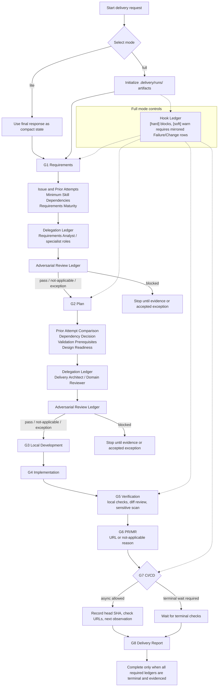

# Skills Hub

Reusable skill suite repository for maintaining agent skill instructions and linking them into agent platforms such as Claude, Codex, and OpenClaw.

## Mobius Harness

`mobius-harness` is the end-to-end delivery entrypoint for this repository. It guides one accountable agent through a complete software delivery loop:

1. Requirements analysis
2. Delivery planning
3. Local worktree development
4. Implementation and local validation
5. PR/MR creation and CI/CD tracking
6. Delivery reporting

Other skills are specialist capabilities that Mobius Harness can delegate to when their evidence is needed:

- `superpowers:brainstorming`: shape creative work, feature behavior, unclear intent, or competing solution paths into a reviewable design.
- `superpowers:writing-plans`: create an executable plan for full deliveries or multi-step implementation.
- `local-repo-development`: inspect repo topology, agent instructions, specs/docs, worktree state, pre-commit review, sensitive information scans, and CI/CD status.
- `refactor-planner`: classify refactor scope and produce a lower-risk phased plan.
- `api-design-review`: review API contracts by API shape and compatibility risk.
- `test-case-generator`: produce executable test matrices by test scope and case family.
- `frontend-ux-polish`: review frontend experience by surface and audit dimension.
- `bug-triage`: classify bugs by bug class, reproduction strategy, severity, and evidence.
- `incident-postmortem`: write incident reviews by incident class and cause analysis.
- `commit-message-writer`: produce commit messages.

## Dependency Decisions

Before changing repository documentation, skills, or harness workflow, decide whether the work introduces a dependency instead of assuming new tools or packages are acceptable:

- Referencing platform-provided skills, plugins, or local agent capabilities such as `superpowers:brainstorming` and `superpowers:writing-plans` is `no-new-dependency`; still record when they are used, not applicable, unavailable, or excepted in the relevant gate or plan.
- Using existing repository scripts, POSIX shell, Git, GitHub CLI, the Python standard library, or tools already required by CI is `existing-toolchain`; if README, docs, or scripts start requiring them, document the validation command and fallback path.
- Adding npm, Python, Go, or Rust packages, system binaries, CI actions, external services, MCP servers, plugin install requirements, or platform-specific runtime capabilities is `new-dependency-required`; document purpose, alternatives, install location, version constraints, validation, CI/CD impact, and rollback.
- For documentation-only process constraints, prefer Markdown gates, artifact templates, or lightweight scripts. Add a dependency only when the constraint cannot otherwise be audited or reproduced.

A dependency decision record must include:

- `Decision`: `no-new-dependency`, `existing-toolchain`, or `new-dependency-required`.
- `Reason`: why existing Markdown, templates, scripts, or platform capabilities are enough or insufficient.
- `Evidence`: related skills, scripts, commands, CI jobs, docs, or failure records.
- `Fallback`: whether the agent should block, degrade, skip, or record an exception when the dependency or platform capability is unavailable.

The current use of `superpowers:brainstorming` and `superpowers:writing-plans` is `no-new-dependency`: they are optional platform-loaded process skills. This repository does not add packages, binaries, CI actions, or runtime install steps for them. Mobius Harness only requires G1/G2 gate evidence that records whether they were used, why they were not applicable, or how unavailable state was handled.

## Skill Standards

Skills in this repository are reusable work standards, not generic prompt snippets. When adding or changing a skill:

- Keep `SKILL.md` and `skill.json` synchronized; their descriptions must match exactly.
- Write descriptions in the `Use when...` form and describe triggering conditions only.
- For nontrivial skills, include concrete scope classification, decision tables, risk classes, or pattern comparisons.
- Make instructions actionable; avoid vague standards such as "stay consistent", "improve quality", or "handle edge cases" unless the exact objects and checks are named.
- Define required output sections, evidence requirements, anti-patterns, and unsupported claims.
- Show the expected output shape in examples; do not use only a one-line conclusion.
- Put large details under `references/`; keep `SKILL.md` focused on triggers, classification, workflow, and output standards.

Existing specialist skills should follow the principle: classify first, choose the pattern second, and produce verifiable output.

## Local Development Constraints

This repository follows the `local-repo-development` workflow:

- Before editing, read repository instruction files including `AGENTS.md`, `README.md`, `docs/SKILL_SPEC.md`, and the relevant skill's `SKILL.md` / `skill.json`.
- If the task involves Mobius Harness, also read `docs/HARNESS.md` and the relevant files under `skills/mobius-harness/references/`.
- Treat each skill directory as an independent capability unit; when changing prose, decide whether `skill.json` instructions, examples, or metadata must also change.
- When a change creates a durable repository standard, update `README.md`, `AGENTS.md`, `docs/SKILL_SPEC.md`, or the relevant skill docs instead of leaving the rule only in conversation.

Long tasks may maintain a local Delivery Episode Package:

```text
.delivery/runs/<run-id>/
  requirements.md
  plan.md
  verification.md
  delivery-report.md
```

`.delivery/runs/` is not committed by default.

Initialize delivery artifacts, Hook Ledger scaffolding, and harness-owned hook scripts/config in a target repository with:

```bash
bash scripts/init-delivery-run.sh <run-id> --request "<user request>" [--mode full|lite] [--gate-type soft|hard] [--runtime auto|codex|claude-code|claude|generic]
```

The script creates the four artifacts under `.delivery/runs/<run-id>/` and prepopulates `Mode`, `G1`-`G8`, Delegation Ledger, Hook Ledger, and Review Ledger rows. It also creates `.delivery/hooks/config.json`, `.delivery/hooks/agent_gate.sh`, and eight executable `.delivery/hooks/<hook-id>.sh` gate scripts. Those scripts read the active run's Hook Ledger and fail when a row is missing, `blocked`, points to a missing evidence artifact, or uses `warn` on a hard gate.

The generated scaffold follows project-level agent hook settings:

- Claude Code receives a `.claude/settings.json` `PreToolUse` / `matcher: Bash` command hook.
- Codex receives the same hook shape under `.codex/settings.json`.
- `generic` writes both.
- In git repositories, `.delivery/`, `.claude/settings*.json`, and `.codex/settings*.json` are added to `.git/info/exclude` so they do not enter PR/MR diffs.
- If `.claude/settings.json` or `.codex/settings.json` is already tracked, initialization writes `settings.local.json` instead of modifying the tracked file.

Initialization settings:

- `--mode` records `full` or `lite`; default is `full`.
- `--gate-type` selects `[soft]` or `[hard]` hook gates; default is `[soft]`.
- `--runtime auto` detects Codex or Claude Code from runtime environment signals and falls back to `generic`.
- `--runtime codex`, `--runtime claude-code`, or `--runtime generic` pins runtime wording and evidence expectations.
- `--runtime claude` is accepted as an alias and normalizes to `Runtime: claude-code`.
- Initialized artifacts are active/draft starting state with blocked gate/delegation/hook/review rows; initialization is not validation.

Run final full-delivery validation with:

```bash
bash scripts/validate-delivery-run.sh .delivery/runs/<run-id>
```

### Delivery Flow

Mobius Harness uses ordered blocking phase gates. Choose `lite` or `full` at the start. Legacy `Lightweight` maps to `lite`; legacy `Standard` / `Strict` map to `full` with soft or hard hook gates.



Required phase state for each phase or subphase:

- Goal
- Checklist
- Gate Ledger
- Delegation Ledger with distinct subagent roles and candidate specialist skills
- Hook Ledger for full deliveries
- Review Ledger with multiple adversarial perspectives
- Todo List
- Failure List
- Change List

Delegated skill output is phase evidence, not a replacement for Mobius Harness gate decisions. A phase cannot close with a missing or `blocked` required gate, delegation, hook, or review row. Any `complete` status must have evidence.

PR/MR CI/CD tracking is asynchronous by default for small iterative updates: record the head SHA, check links, and next observation point, then return control to the user. Wait for terminal CI/CD only when the user asks, the delivery is about to merge or release, repository policy requires terminal checks, or an observed failure needs a synchronous follow-up. Do not claim CI/CD passed until checks for the current head SHA are terminal and successful.

The delivery artifacts must follow [docs/HARNESS.md](docs/HARNESS.md).

## Executable Examples

The repository includes `examples/delivery-runs/` as executable fixtures:

- `passing`: a complete Delivery Episode Package that must pass.
- `exception`: an accepted exception mirrored in Failure List and Change List.
- `blocked`: a negative fixture with a blocked gate that the validator must reject.

CI validates both positive fixtures and negative fixtures.

`scripts/test-delivery-run-validator.sh` generates temporary negative cases for missing `Mode`, missing Delegation Ledger, missing Issue and Prior Attempts, missing Prior Attempt Comparison, missing Minimum Skill Dependencies, missing Validation Prerequisites, missing Superpowers decisions, missing Requirements Maturity, missing Design Readiness, missing Dependency Decision, duplicate gates, missing release report, missing Hook Ledger, blocked hooks, hard gates downgraded to `warn`, soft-gate warning audit records, misplaced hooks, duplicate hooks, missing Review Ledger, blocked reviews, misplaced reviews, and duplicate reviews.

`scripts/test-init-delivery-run.sh` checks that initialization generates complete Mode, Gate/Delegation/Hook/Review Ledger scaffolding, issue and prior-attempt sections, prior-attempt comparison, minimum skill dependencies, validation prerequisites, soft/hard gate labels, Codex/Claude Code/generic runtime-specific hooks, automatic Codex runtime detection, and overwrite protection.

`examples/pressure-scenarios/mobius-harness.md` provides manual or agent-to-agent pressure scenarios that check whether an agent actually stops when requirements, plans, gates, hooks, reviews, or mirrored exceptions are missing.

If a delivery is interrupted, the next agent should read `.delivery/runs/<run-id>/`, find the earliest incomplete phase or subphase, then continue from Todo List, Failure List, Change List, and current git state.

## Repository Layout

```text
.
├── docs/
│   ├── HARNESS.md
│   └── SKILL_SPEC.md
├── AGENTS.md
├── scripts/
│   ├── create-skill.sh
│   ├── init-delivery-run.sh
│   ├── link_skills.sh
│   ├── validate-delivery-run.sh
│   ├── test-init-delivery-run.sh
│   ├── test-delivery-run-validator.sh
│   └── validate-skills.sh
├── skills/
│   ├── mobius-harness/
│   │   ├── SKILL.md
│   │   ├── skill.json
│   │   └── references/
│   │       ├── delivery-process.md
│   │       ├── artifact-interface.md
│   │       ├── artifact-templates.md
│   │       ├── hook-policy.md
│   │       └── governance-and-reporting.md
│   ├── local-repo-development/
│   │   ├── SKILL.md
│   │   └── skill.json
│   └── ...
└── README.md
```

## Usage

Link skills into target platform skill directories:

```bash
bash scripts/link_skills.sh /path/to/claude/skills /path/to/codex/skills /path/to/openclaw/skills
```

The script symlinks each directory under `skills/`; target platforms read `SKILL.md` and `skill.json` directly.

## Codex Compatibility

For local Codex discovery, `SKILL.md` should include YAML frontmatter with at least:

```md
---
name: my-skill
description: One-line description.
---
```

- `name` should match `skill.json.id` and the directory name.
- `description` should match `skill.json.description`.
- `skill.json` alone is not enough for reliable local Codex discovery; Codex reads `SKILL.md` metadata.

The built-in `create-skill.sh` script generates compatible frontmatter by default.

## Add A Skill

```bash
bash scripts/create-skill.sh my-new-skill
```

The script creates `skills/my-new-skill/` with `SKILL.md` and `skill.json` templates. Fill in the TODOs before using the skill.

Manual creation is also supported:

1. Create a directory under `skills/`, for example `my-new-skill/`.
2. Add `SKILL.md` as the human-readable work standard.
3. Add `skill.json` as the machine-readable structured data.
4. Follow [docs/SKILL_SPEC.md](docs/SKILL_SPEC.md).
5. Add scope classification, decision tables, output standards, and examples that match this README's Skill Standards.
6. If the new skill changes repository-level constraints, update [AGENTS.md](AGENTS.md).

## CI Validation

Every push and PR checks:

- Each skill directory contains `SKILL.md` and `skill.json`.
- `skill.json` is valid JSON and includes all required fields.
- `skill.json.id` matches the directory name.
- `SKILL.md` frontmatter `name` / `description` matches skill metadata.
- The PR or push diff has no whitespace errors.
- Delivery run validator positive fixtures, exception fixtures, blocked negative fixtures, and generated negative regression tests pass.

Run locally before finishing skill changes:

```bash
bash scripts/validate-skills.sh
bash scripts/test-init-delivery-run.sh
bash scripts/test-delivery-run-validator.sh
git diff --check
```
